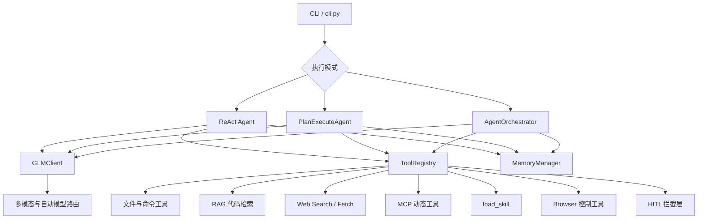
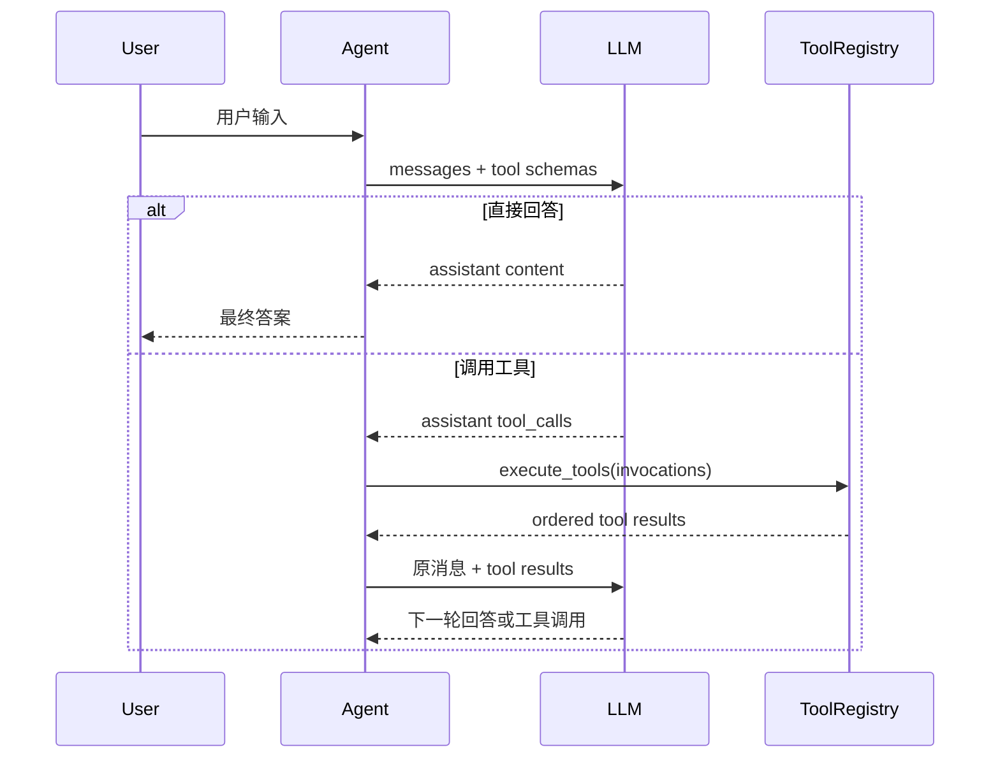
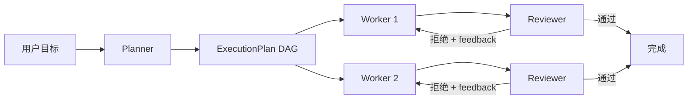
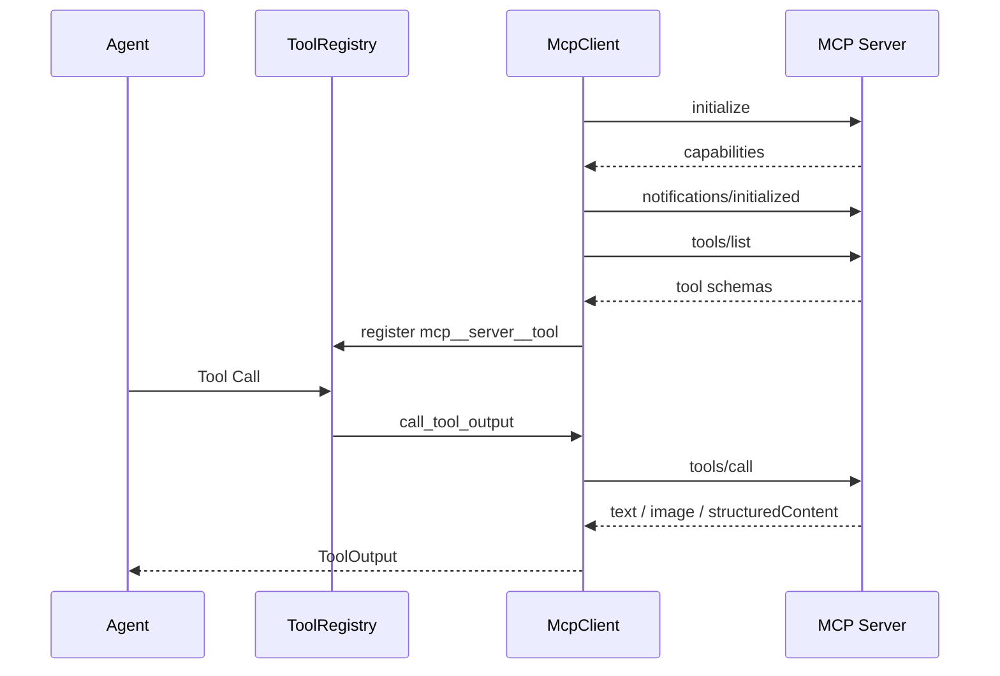

# StellarCode Python 技术报告

## 摘要

StellarCode Python 是一个面向学习和工程实验的命令行 Agent，实现了从 ReAct、工具调用、任务规划、记忆、代码检索到 Multi-Agent、MCP、浏览器控制、Skill 和多模态输入的完整链路。项目不是对 Java 代码的逐行翻译，而是使用 Python 的数据类、协议、线程、标准库 AST、SQLite 和 HTTP 客户端重新组织各模块，使每个阶段都能独立测试，并通过统一的 `ToolRegistry` 组合到三条执行路径中。

本文以当前 Python 仓库的实际代码为准，按十二个章节说明设计目标、模块划分、关键流程、依赖、运行方式和验证方法。报告对应项目版本 `0.1.0`，要求 Python 3.10 及以上。

## 项目概览

### 设计目标

项目的核心目标包括：

1. 让大模型能够通过结构化 Tool Call 操作文件、执行命令和读取外部信息。
2. 将复杂目标拆成可验证的 DAG，并支持依赖感知的并行执行。
3. 在短期上下文之外提供可持久化、可检索的长期记忆。
4. 通过 Planner、Worker 和 Reviewer 实现角色化协作。
5. 使用 RAG、联网搜索、MCP 和浏览器扩展 Agent 的信息边界。
6. 使用 HITL、网络策略和审计日志管理高风险操作。
7. 支持本地图片、剪贴板图片和 MCP 截图，并自动选择视觉模型。

### 总体架构



三条主执行路径共享工具注册表、记忆管理器和 LLM Client：

| 执行路径 | 入口类 | CLI 触发方式 | 适用场景 |
| --- | --- | --- | --- |
| ReAct | `stellarcode.agent.Agent` | 默认 | 交互式问答和工具调用 |
| Plan-and-Execute | `stellarcode.plan.PlanExecuteAgent` | `/plan` | 有明确阶段和依赖的复杂任务 |
| Multi-Agent | `stellarcode.multi_agent.AgentOrchestrator` | `/team` | 需要规划、执行和审阅的任务 |

### 主要依赖

| 依赖 | 用途 |
| --- | --- |
| `httpx` | LLM、Embedding、联网和 Streamable HTTP MCP |
| `python-dotenv` | 加载 `.env` 配置 |
| `rich` | 审批面板和终端输出 |
| `jieba` | 中文查询切词和关键词检索 |
| `beautifulsoup4`、`markdownify` | HTML 正文抽取和 Markdown 转换 |
| `mcp` | MCP 生态兼容依赖 |
| `Pillow` | 图片解码、剪贴板读取、压缩和格式转换 |
| `uapi-sdk-python` | 天气 MCP 示例服务 |
| Python `ast`、`sqlite3` | 代码分析和本地向量存储 |

## 第一章：ReAct 与 Tool Call

### 1.1 ReAct 循环

ReAct 将推理和行动组织为多轮循环。用户输入先作为 `user` 消息进入上下文，模型可以直接返回答案，也可以生成一个或多个 Tool Call。工具执行结果以 `tool` 消息回传，模型再根据结果继续推理。



`Agent.run()` 是主循环入口，默认最多执行 8 轮工具调用。达到上限后，Agent 会关闭工具并额外请求一次最终回答，避免只输出 `Stopped after 8 iterations` 而没有原因。相同工具调用连续失败两次时，也会停止重复尝试，并要求模型解释失败原因和下一步操作。

### 1.2 Tool Schema

每个工具由 `ToolDefinition` 描述：

```python
ToolDefinition(
    name="read_file",
    description="Read a UTF-8 text file.",
    parameters={
        "type": "object",
        "properties": {"path": {"type": "string"}},
        "required": ["path"],
    },
    handler=read_handler,
)
```

`to_openai_tool()` 将它转换成 OpenAI-compatible Function Calling 格式。模型看到的是名称、描述和 JSON Schema，而不是 Python 函数本身。

### 1.3 工具注册与执行

`ToolRegistry` 负责：

- 注册和注销工具；
- 生成提供给模型的 Schema；
- 解析模型返回的 JSON 参数；
- 将异常转换成可回传给模型的工具错误；
- 并行执行同一轮中的独立工具；
- 保持结果顺序与 Tool Call 顺序一致。

当前内置工具包括：

- `read_file`
- `write_file`
- `apply_patch`
- `delete_file`
- `list_dir`
- `glob_files`
- `grep_code`
- `execute_command`
- `search_code`
- `web_search`
- `web_fetch`

动态 MCP 工具和 `load_skill` 也会注册到同一个 Registry，因此 Agent 不需要为不同来源的工具编写不同的推理循环。

桌面 Runtime 中，每个任务会在 Side-Git PRE 快照对应的独立 Git worktree 内运行这些
内置文件工具和 `execute_command`。终态通过 binary patch 预检后串行合并回项目；冲突
不会覆盖项目现状。详细边界见 `docs/task-git-worktree-isolation.md`。

### 1.4 文件访问设计

`--workspace` 是相对路径解析和命令执行的起点，不是文件系统安全边界。内置文件工具接受绝对路径和包含 `..` 的路径，可以访问当前操作系统用户有权限访问的位置。删除工具只允许删除普通文件，不递归删除目录，并拒绝根目录等危险目标。

## 第二章：Plan-and-Execute 与 DAG

### 2.1 规划结果

`Planner` 要求模型返回结构化 JSON：

```json
{
  "summary": "实现并验证功能",
  "tasks": [
    {
      "id": "task_1",
      "description": "读取现有实现",
      "type": "FILE_READ",
      "dependencies": []
    },
    {
      "id": "task_2",
      "description": "修改代码",
      "type": "FILE_WRITE",
      "dependencies": ["task_1"]
    }
  ]
}
```

Python 端不会直接相信模型输出。`Planner.parse_plan()` 会提取 JSON、检查任务列表、规范化任务 ID、解析任务类型并验证依赖。

### 2.2 DAG 与拓扑排序

`ExecutionPlan` 将任务组织为有向无环图。边 `A -> B` 表示 B 依赖 A。拓扑排序用于检测环并给出合法执行顺序。

```text
function topological_sort(tasks):
    indegree = 每个任务的依赖数量
    ready = 所有 indegree 为 0 的任务
    order = []

    while ready 非空:
        task = ready.pop()
        order.append(task)

        for dependent in 依赖 task 的任务:
            indegree[dependent] -= 1
            if indegree[dependent] == 0:
                ready.push(dependent)

    if len(order) != len(tasks):
        raise CycleDetected
    return order
```

除了线性顺序，项目还计算执行批次。处于同一依赖层且互不依赖的任务可以并行执行。

### 2.3 执行状态

任务状态包括：

- `PENDING`
- `RUNNING`
- `COMPLETED`
- `FAILED`
- `SKIPPED`

某个任务失败后，依赖它的后续任务会被跳过。执行完成后，`ExecutionPlan.build_result()` 汇总每个任务的状态、结果和错误。

### 2.4 Plan Agent

`PlanExecuteAgent` 为每个可执行任务创建一个短生命周期 ReAct Agent。任务提示包含总体目标、当前任务描述和已完成依赖的结果。默认一个依赖层最多并行执行 4 个任务，可通过 `--plan-workers` 调整。

## 第三章：Memory 系统

### 3.1 记忆层次

Memory 分为两层：

| 层次 | 实现 | 生命周期 | 默认位置/预算 |
| --- | --- | --- | --- |
| 短期记忆 | `ConversationMemory` | 当前进程和会话 | 8192 估算 tokens |
| 长期记忆 | `LongTermMemory` | 跨进程持久化 | `~/.stellarcode/memory/long_term_memory.json` |

`MemoryEntry` 保存 ID、内容、类型、元数据、时间和 token 估算。类型包括对话、事实、工具结果和摘要。

### 3.2 短期记忆压缩

每次写入用户消息、助手消息或工具结果后，`MemoryManager` 会检查 token 预算。超过短期预算或可用上下文 80% 时，`ContextCompressor` 将早期条目压缩为摘要，并保留最近 3 条记录。

当前摘要是确定性文本拼接，不会额外调用 LLM，因此成本低且容易测试，但摘要质量不如模型生成摘要。

### 3.3 长期记忆持久化

用户可以使用以下命令显式保存和检索：

```text
/save 项目使用 Python 3.10
/recall Python 版本
/memory
```

`LongTermMemory.store()` 会按完整内容去重，每次写入后立即保存 JSON，启动时自动加载。除此之外，压缩器还会根据“记住、偏好、使用、项目、配置、JDK、Python、Maven”等标记，从被压缩的旧对话中启发式提取事实并写入长期记忆。这种自动提取便于演示，但可能产生误保存，生产版本应增加用户确认、置信度或可审计管理命令。

### 3.4 记忆检索

`MemoryRetriever` 使用 `jieba` 和正则切词，分别匹配内容与 metadata。长期记忆权重为 1.2，短期记忆权重为 1.0。默认最多检索约 500 tokens 的相关记忆。检索结果不会进入 system prompt，而是紧邻当前真实请求，以 `user` role 的 `stellarcode.context/v1` JSON 数据消息注入，并显式标记 `trusted=false`。上下文压缩摘要使用同一边界；Runtime 私有类型字段会在调用模型前移除，避免兼容 API 拒绝未知字段，同时保持 system 前缀稳定、降低 Memory Prompt Injection 风险。

`/clear` 会清空当前 Agent 上下文和短期记忆，但保留长期 JSON。

## 第四章：Multi-Agent 协作

### 4.1 三种角色

Multi-Agent 由以下角色组成：

| 角色 | 职责 | 是否调用工具 |
| --- | --- | --- |
| Planner | 将用户目标拆成 DAG | 否 |
| Worker | 执行一个具体步骤 | 是 |
| Reviewer | 检查结果完整性和证据 | 否 |

每个 `SubAgent` 有独立的 system prompt 和消息历史，但共享 LLM Client、Tool Registry 和 MemoryManager。

### 4.2 编排流程



`AgentOrchestrator` 按 DAG 执行层分批运行 Worker。依赖结果会作为只读上下文传给后续任务，每个依赖结果最多保留 500 字符。Reviewer 返回：

```json
{
  "approved": true,
  "summary": "结果正确",
  "issues": [],
  "suggestions": []
}
```

未通过时，Worker 根据反馈重试，默认最多 2 次。Reviewer 输出损坏或不可用时，系统会保留 Worker 结果，但标记审阅不可用。

### 4.3 MessageBus 与可靠消费

Lead、Planner、Worker 和 Reviewer 不再以 Python 函数返回值作为跨角色通信通道，而是通过每次 Team 运行独立的 `FileMessageBus` 通信。每个角色拥有一个 append-only `.jsonl` 邮箱：Lead 生产 `task` / `review_request`，角色消费者以租约 claim 消息，完成后先向 Lead 邮箱追加 `*_result`，再确认原消息。

邮箱记录不会采用“读取后删除”的方式消费。确认状态、尝试次数和租约单独保存；Sidecar 或 Worker 崩溃后，过期租约会重新投递，超过最大尝试次数才写入 `dead-letter.jsonl`。因此协议提供 at-least-once delivery，带文件副作用的消费者仍需依据 `message.id` / `correlation_id` 保持幂等。

### 4.4 隔离与共享

Worker 在并行任务前后清空历史，避免一个步骤的上下文泄漏到另一个步骤。每个角色还拥有独立的 `SkillContextBuffer`，通过 `contextvars` 在工具线程中传播，避免并发 Worker 相互消费 Skill 内容。

## 第五章：RAG 代码检索

### 5.1 索引流程

RAG 由四个阶段组成：

```text
源文件 -> CodeChunker -> EmbeddingClient -> SQLite VectorStore
                    \-> CodeAnalyzer -> 代码关系表
```

Python 文件使用标准库 `ast` 切分为 class、method 和 function 级别的真实代码块。非 Python 文件按最多 2000 字符分块。Python AST 还会提取 import、继承、包含和调用等关系。

索引会跳过 `.git`、`.venv`、`node_modules`、`target`、`dist` 等目录。当前支持 `.py`、`.java`、`.js`、`.ts`、`.md`、`.json`、`.yaml` 等后缀。当前 `INDEXED_SUFFIXES` 尚未包含 `.txt`，因此纯文本测试文档应暂时使用 `.md`，或者后续显式加入 `.txt`。

### 5.2 Embedding Provider

支持以下 Embedding 来源：

- Ollama，默认模型 `nomic-embed-text:latest`；
- 智谱/OpenAI-compatible Embedding API；
- 本地 256 维 hash embedding，用于无模型烟雾测试。

默认 Ollama 配置：

```dotenv
EMBEDDING_PROVIDER=ollama
EMBEDDING_MODEL=nomic-embed-text:latest
EMBEDDING_BASE_URL=http://localhost:11434
```

### 5.3 混合检索

`CodeRetriever.hybrid_search()` 同时执行：

1. Embedding cosine similarity 语义检索；
2. `jieba` 查询词的 SQLite 关键词检索；
3. 对名称、路径和正文命中的结果加权；
4. 合并相同 chunk，语义与关键词同时命中时增加 0.1；
5. 每个文件最多返回 2 个结果，避免单文件垄断 top-k。

当 Embedding 服务不可用时，语义错误会被记录，关键词检索仍可继续工作。

### 5.4 使用方式

```text
/index
/search 哪个组件负责管理充电优先级
/graph Agent
```

模型也可以自动调用 `search_code`。`top_k` 表示最多返回多少个候选代码块，不代表每个结果一定相关。

## 第六章：HITL 人工审批

### 6.1 两种访问模式

CLI 默认使用 `restricted` 模式，高风险工具自动审批，不需要 `/hitl on`。可以在运行中切换：

```text
/mode restricted
/mode full-access
```

切换到 `full-access` 必须输入 `FULL ACCESS` 确认。该模式关闭 StellarCode 审批和命令策略，但仍受操作系统权限、远程服务认证和第三方 API 限制。

需要特别说明：当前 restricted 模式不是容器或操作系统沙箱，也没有 workspace 路径隔离。它主要提供危险工具审批和明显全盘递归扫描拦截。

### 6.2 风险策略

| 工具 | 风险等级 | 默认处理 |
| --- | --- | --- |
| `read_file`、`list_dir`、`glob_files`、`grep_code` | safe | 直接执行 |
| `web_search`、`web_fetch` | safe | 直接执行 |
| `write_file`、`apply_patch`、`create_project` | medium | 请求审批 |
| `delete_file`、`execute_command` | high | 请求审批 |
| 普通 `mcp__*` | medium | 请求审批 |
| `mcp__chrome-devtools__*` | safe | 直接执行 |

### 6.3 审批交互

终端审批支持：

- `y` 或 Enter：批准本次；
- `a`：本会话持续批准当前工具或整个 MCP Server；
- `n`：拒绝，并可输入原因；
- `s`：跳过；
- `m`：输入新的 JSON 参数后执行。

拒绝原因会以 `[HITL] Operation rejected: ...` 作为工具结果返回 Agent，因此模型可以解释用户拒绝，而不是误认为工具执行失败。

### 6.4 并发审批同步

`TerminalHitlHandler` 使用 `threading.RLock` 覆盖审批面板、输入和决策全过程。Multi-Agent 或并行工具同时产生危险操作时，审批请求会串行显示，避免多个线程争抢 stdin。

## 第七章：多并发执行

项目包含三个层次的并发：

### 7.1 同轮工具并发

当一次 LLM 响应包含多个独立 Tool Call 时，`ToolRegistry.execute_tools()` 使用任务队列和后台线程执行。默认：

- 最大并发工具数：4；
- 批次超时：90 秒；
- 单工具调用仍在当前线程执行；
- 返回结果始终保持原始调用顺序；
- 超时结果会明确标记 `timed_out=True`。

`contextvars.copy_context()` 将当前 Skill 上下文复制到工具线程。

### 7.2 Plan DAG 并发

Plan-and-Execute 将同一 DAG 层的任务提交给 `ThreadPoolExecutor`，默认最多 4 个并行任务。依赖任务必须等待上一层完成。

### 7.3 Multi-Agent Worker 并发

Orchestrator 维护 Worker 池，同一 DAG 层可由多个 Worker 并行处理。每个并行步骤使用独立 Reviewer，避免 Reviewer 历史和状态争用。

### 7.4 HITL 与并发的组合

restricted 模式会先串行收集危险工具审批，再并发执行已经批准的调用。这样既保留并发收益，也保证终端只有一个输入拥有者。

## 第八章：联网搜索

### 8.1 搜索路由

`SearchProviderFactory` 支持：

- 智谱 Web Search；
- SerpAPI；
- SearXNG；
- Wikimedia/Wikipedia 无 Key 兜底。

`SmartSearchProvider` 先调用主 Provider，再根据查询实体词评估相关性。主结果质量不足时，尝试其他已配置 Provider 和 Wikimedia fallback。

### 8.2 质量评估

搜索结果会输出：

- Provider 名称；
- 结果数量；
- `high`、`medium` 或 `low` 质量；
- 相关结果比例；
- 最多 3 个建议抓取 URL。

中文实体词通过 `jieba` 提取，英文和韩文使用正则提取。标题、摘要、URL 和站点可信度共同影响排名。低质量搜索不等于事实不存在，Agent Prompt 会要求继续抓取候选页面或说明证据不足。

### 8.3 Web Fetch

`WebFetcher` 对已知 URL 进行静态抓取：

- 只允许 HTTP/HTTPS；
- 拒绝 URL 内嵌账号密码；
- DNS 解析后阻止 localhost、私网、链路本地等非公网地址；
- 每次重定向重新执行网络策略；
- 最多 5 次重定向；
- 最大响应体 5 MB；
- 默认最多返回 8000 字符；
- 默认每 60 秒最多 30 次逻辑抓取；
- HTML 使用 BeautifulSoup 和 markdownify 提取正文。

SPA、防爬页面或需要交互的站点会回退到 Chrome DevTools MCP。Agent 对单任务 `web_search` 默认限制为 4 次，防止通过不断改写查询耗尽全部工具轮次。

## 第九章：MCP 接入与 Chrome DevTools MCP

### 9.1 MCP 通信结构



当前协议版本为 `2025-03-26`。MCP Client 与 Server 之间使用 JSON-RPC 2.0；大模型本身不会直接发送 JSON-RPC，而是生成普通 Tool Call，由 StellarCode Client 转换为 MCP `tools/call` 请求。

### 9.2 Transport

实现两种传输：

- `StdioTransport`：StellarCode 启动子进程，通过 stdin/stdout 传输 JSON-RPC；
- `StreamableHttpTransport`：通过 HTTP/SSE 传输，并维护 `Mcp-Session-Id`。

MCP Server 可以包含多个 Tool，不要求一个 Tool 对应一个独立 Server。

### 9.3 动态注册

服务端工具注册为：

```text
mcp__{server_name}__{tool_name}
```

`McpClient` 会清洗 Server 提供的 JSON Schema，去除不兼容的 `$ref`、`$defs` 等结构。多个 Server 启动互相隔离，一个 Server 失败不会阻止其他 Server 注册。

配置从用户级和项目级 `mcp.json` 合并，项目配置覆盖同名用户配置。环境变量占位符在启动前展开。

### 9.4 工具结果与审计

MCP 文本返回普通 Tool Result；`structuredContent` 在无正文时格式化成 JSON；图片转换为结构化 `ToolOutput.image_parts`。调用记录写入：

```text
.stellarcode/audit/mcp-tools.jsonl
```

审计会遮蔽 token、password、secret 等敏感参数。

### 9.5 Chrome DevTools MCP

Chrome DevTools MCP 与其他 MCP 工具使用同一注册机制。跨工具选择流程只由 `web-access` Skill 维护：

1. 普通公开 URL 先 `web_fetch`；
2. JavaScript、交互、网络日志或静态抓取失败时使用 Chrome；
3. 阅读页面优先 `take_snapshot`；
4. 用户明确需要视觉检查时使用 `take_screenshot`。

当前 Chrome DevTools 工具在 HITL 策略中被配置为 safe，不弹出 StellarCode 审批。

## 第十章：CDP 会话复用

### 10.1 isolated 与 shared

| 模式 | 浏览器状态 | 用途 |
| --- | --- | --- |
| isolated | 临时独立 Profile，无用户 Cookie | 公开页面和自动化测试 |
| shared | 连接用户已登录 Chrome | 私有仓库、内部系统、登录后页面 |

默认是 isolated，避免公开任务不必要地接触用户登录状态。

### 10.2 autoConnect 与传统端口

`browser_connect` 默认用 Chrome DevTools MCP 的 `--autoConnect` 参数连接 Chrome 的授权远程调试能力。也可以传端口，使用传统 `http://127.0.0.1:{port}/json/version` CDP 入口。

CLI 和 Agent 都可以使用：

```text
/browser status
/browser connect
/browser tabs
/browser disconnect
```

Agent 侧对应内置工具 `browser_status`、`browser_connect`、`browser_tabs` 和 `browser_disconnect`。

### 10.3 Shared 安全保护

`BrowserGuard` 跟踪 Agent 在 shared 会话中新建的标签页。`close_page` 只能关闭 Agent 自己创建的页面，不能关闭用户原有标签页。完成需要登录态的任务后，Agent 应调用 `browser_disconnect` 返回 isolated 模式。

## 第十一章：工作流 Skills

### 11.1 Skill 的定位

Skill 不是可执行函数，而是一组按需加载的领域指引。工具 Schema 负责“单个工具能做什么”，Skill 负责“在什么情况下以什么顺序组合工具”。内置 `web-access` Skill 描述联网和浏览器选择策略；`code-exploration` Skill 描述文件发现、精确搜索、RAG、读取、修改与验证流程。system prompt 只保留安全、权限、验证等全局规则和 RAG 当前运行模式，不重复这些工作流。

### 11.2 模板与两层发现

运行时只扫描两个可编辑层，后层同名 Skill 覆盖前层：

1. 用户 `~/.stellarcode/skills`；
2. 项目 `.stellarcode/skills`。

发行包中的 `src/stellarcode/skills` 是模板来源；启动和 reload 会把缺失模板复制到用户层，但不会覆盖用户已有版本。每个 Skill 目录包含 `SKILL.md`，可包含 frontmatter、正文和 `references/`。解析警告会在启动和 Skill 命令中展示。启用状态写入 `~/.stellarcode/skills.json`，写入失败会作为可见警告返回。

### 11.3 Prompt 索引与懒加载

system prompt 只注入 Skill 名称和简介索引，而不是完整正文：

- 最多 20 个 Skill；
- 索引最多 4096 bytes；
- 单个 description 最多 500 字符。

模型需要详细指引时调用：

```json
{
  "name": "load_skill",
  "arguments": {"name": "web-access"}
}
```

正文最多加载 5 KB，写入 `SkillContextBuffer`。Buffer 最多保留 3 个 Skill；工具批次完成后立即 `drain()`，并以前置 user-role 上下文进入当前任务的下一次 LLM 调用。这样既不动态修改 system prompt，也不需要用户额外发送“继续”，同时减少稳定前缀失效和常规轮次 token 开销。

### 11.4 Multi-Agent Buffer

每个 Planner、Worker 和 Reviewer 都持有独立 Buffer。`ContextVar` 指向当前执行角色的 Buffer，并在线程切换时复制上下文，防止并发角色相互消费加载内容。

## 第十二章：多模态能力

### 12.1 输入形式

当前支持：

```text
分析 @image:screen.png
对比 @image:<before image.png> 和 @image:"after image.png"
分析刚复制的截图 @clipboard
```

`ImageReferenceParser` 解析引用，相对路径以 `--workspace` 为基准。`@clipboard` 使用 Pillow `ImageGrab` 读取 GUI 剪贴板，并缓存到 `~/.stellarcode/cache`。

当前 CLI 使用 Python `input()`，因此不能直接把图片对象通过 Ctrl+V 传入进程。Ctrl+V 只能粘贴终端文本；图片需要显式写 `@clipboard`。

### 12.2 图片预处理

`ImageProcessor` 的边界：

- 源文件最大 50 MB；
- API Base64 最大 5 MB；
- 超限时按比例缩放到最多 2000x2000；
- 优先 PNG，无损结果仍超限时尝试多档 JPEG 质量；
- 必要时进一步缩放到 1200x1200；
- Alpha 图片铺白底，避免不同 Provider 对透明通道解释不一致；
- 不相信扩展名，使用 Pillow 实际解码验证。

模型消息使用 OpenAI-compatible 内容数组：

```json
{
  "role": "user",
  "content": [
    {"type": "text", "text": "描述图片"},
    {
      "type": "image_url",
      "image_url": {"url": "data:image/png;base64,..."}
    }
  ]
}
```

### 12.3 MCP 图片回灌

MCP 截图不能直接塞进 `tool` 角色消息，因为不同 Provider 对 Tool Message 多模态支持不一致。项目先写入普通工具文字结果，再追加一条包含图片的 `user` 消息，让模型在下一轮观察图片。

### 12.4 自动模型选择

`GLMClient` 按每次请求的消息结构路由：

```python
if messages 中存在 image_url:
    model = GLM_VISION_MODEL
    api_key = GLM_VISION_API_KEY or GLM_API_KEY
else:
    model = GLM_MODEL
    api_key = GLM_API_KEY
```

默认视觉模型是 `glm-5v-turbo`，可覆盖为 `glm-4.6v-flash`。没有固定 `GLM_BASE_URL` 时，文本请求使用 Coding API，图片请求使用标准多模态 API。同一图片任务中的后续工具轮次继续使用视觉模型；下一次外部任务前，历史 Base64 被裁剪，纯文本任务自动回到文本模型。

推荐配置：

```dotenv
GLM_MODEL=glm-5.1
GLM_VISION_MODEL=glm-4.6v-flash
# Coding Plan Key 无法访问标准多模态 API 时单独配置：
# GLM_VISION_API_KEY=your_standard_bigmodel_api_key
```

设置 `GLM_VISION_MODEL=disabled` 可以关闭视觉路由。文本模型收到图片时会省略二进制，并得到明确的“不支持图片附件”提示。

### 12.5 API 错误处理

`GLMApiError` 会展示 HTTP 状态、请求模型、智谱业务错误码和消息。对 `1302` 账户限流和 `1305` 模型繁忙执行最多两次指数退避；余额不足、额度耗尽和模型无权限不会盲目重试。

## 启动、配置与验证

### 安装

```powershell
cd "E:\study2\LLM Internship\PaiCLI\stellarcode"
python -m venv .venv
.\.venv\Scripts\Activate.ps1
python -m pip install -e ".[dev]"
Copy-Item .env.example .env
```

### 启动

```powershell
stellarcode
```

常用参数：

```powershell
stellarcode `
  --workspace . `
  --memory-dir .stellarcode-memory `
  --rag-dir .stellarcode-rag `
  --mode restricted `
  --max-parallel-tools 4 `
  --tool-batch-timeout 90
```

### 测试矩阵

| 测试文件 | 覆盖内容 |
| --- | --- |
| `test_agent_loop.py` | ReAct、工具调用、错误诊断 |
| `test_plan.py` | Planner、DAG、拓扑排序、并行层 |
| `test_memory.py` | 短期、长期、压缩和检索 |
| `test_multi_agent.py` | Planner/Worker/Reviewer 和重试 |
| `test_rag.py` | AST 分块、Embedding、SQLite、混合检索 |
| `test_hitl.py` | 风险策略、审批、拒绝和参数修改 |
| `test_parallel_tools.py` | 并发上限、顺序和超时 |
| `test_web.py` | 搜索质量、fallback、SSRF 和正文抓取 |
| `test_mcp.py` | JSON-RPC、Transport、动态工具和审计 |
| `test_browser.py` | isolated/shared、CDP 和标签页保护 |
| `test_skill.py` | Skill 模板、两层覆盖、即时 Buffer、warning 和状态 |
| `test_image.py` | 图片引用、压缩、模型路由和 API 错误 |

当前验证命令：

```powershell
.\.venv\Scripts\python.exe -m ruff check src tests
.\.venv\Scripts\python.exe -m pytest -q
```

当前全量结果为 `405 passed, 1 skipped`，Ruff 检查通过。

## 当前边界与后续方向

1. restricted 模式是审批层，不是容器、虚拟机或操作系统沙箱。
2. 当前只实现 GLM 主 Chat Client；多 Provider 路由仍可扩展。
3. `.txt` 尚未进入 RAG 默认索引后缀。
4. Ctrl+V 图片不能被 `input()` 直接捕获，仍需 `@clipboard`。
5. 自动长期事实提取基于关键词，可能保存不稳定信息。
6. 设置固定 `GLM_BASE_URL` 后，文本和视觉请求都会使用同一端点。
7. MCP Server 自动重启、OAuth、sampling 和资源订阅尚未实现。
8. CLI 会话历史不跨进程持久化，跨会话信息主要依赖长期记忆 JSON。

## 结论

StellarCode Python 已形成一个可运行、可测试、可扩展的 Agent 框架。十二个阶段并不是彼此孤立的功能：ReAct 提供统一循环，Plan 和 Multi-Agent 复用该循环，Memory 与 RAG 提供上下文，HITL 和网络策略控制风险，并发提高吞吐，MCP 和 Chrome 扩展环境能力，Skill 提供按需方法论，多模态则把工具结果和视觉输入纳入同一消息协议。

Python 版本的主要工程价值在于模块边界清楚、依赖较轻、测试速度快，并且可通过 Protocol、dataclass、contextvars 和标准库并发能力快速验证 Agent 架构。下一步应优先完善真正的安全沙箱、持久化会话管理和更完整的多 Provider 路由。
